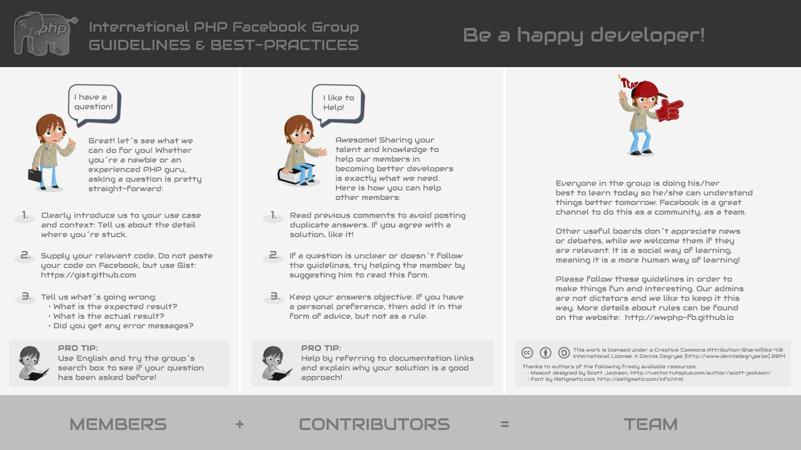

    

        

        <h3 style="font-family:Audiowide;text-align:center">Welcome developer</h3>
        
to the GitHub Pages of the <strong>international PHP Facebook Group</strong>,
        the following pages will show you our rules, a qualified FAQ containing
        most asked questions from our daily discoveries in our group and a small
        overview who is representing the group as its staff.

        
But first, keep in mind that you accept the <a href="rules.html">following rules</a> of our group if you request a membership.

    

    

            have a good time at our group and don't be shy to ask your question.
    

    

            &laquo;Stay hungry, stay foolish.&raquo; <small><cite><a href="http://news.stanford.edu/news/2005/june15/jobs-061505.html">2005 - Steve Jobs &dagger;</a></cite></small>
    

